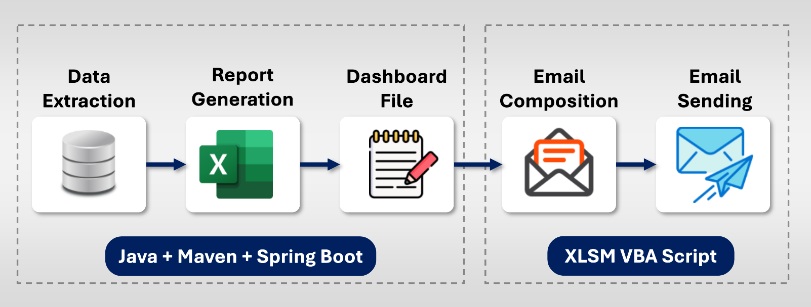

# Automated-Reporting-Data-Monitoring-Dashboard
Developed a Java + Maven project to automaate daily report generation, including data extraction, formating, validation, calculation and error highlighting. Integrated Excel-based outputs with automated email delivery to stakeholders. Build a lighweight dashboard to monitor daily transactions, reducing effort by 70% and improving accuracy.

# 📊 Report Automation System  
*Automating Reports. Simplifying Insights.*

## 📝 Description  
The **Report Automation System** is an **end-to-end intelligent reporting solution** that automates the entire lifecycle of business reports — from **data extraction** to **dashboard integration** and **automated email delivery**.

- Built on **Spring Boot** with a robust **MVC architecture**, ensuring scalability and clean separation of concerns.  
- Each report is exposed through a dedicated **REST API**, enabling modularity and reusability.  
- Processed data is seamlessly integrated into a **centralized Excel Dashboard**, with an intermediate **Notes Sheet** to track key updates, KPIs, and metadata.  
- **Excel Macros (XLSM / VBA)** automate tasks such as refreshing values and distributing reports via **Outlook**, ensuring stakeholders receive up-to-date insights without manual effort.

This system not only **reduces manual intervention** but also **enhances accuracy, speed, and consistency** of reporting across business teams — and the entire reporting process can be executed in just **2 clicks**:  
1️⃣ Hit the **API** to generate the report sheet.  
2️⃣ Run the **XLSM macro** to refresh values and send emails.

---

## 🛠️ Tech Stack  

**Backend & APIs**  
- 

   Java 21 &nbsp;&nbsp;
   Spring Boot (MVC) &nbsp;&nbsp;
   Maven

**Database**  
- 

   MySQL

**Dashboard & Automation**  
- 

   Excel (Dashboard) &nbsp;&nbsp;
   VBA Macros

**Email Integration**  
- 

   Microsoft Outlook

**Other Tools**  
- 

   Git &nbsp;&nbsp;
   GitHub &nbsp;&nbsp;
   Postman

---

## 📊 Report Automation Working Flow

The following block diagram illustrates the **end-to-end flow** of our Report Automation System:

---

### 🔎 Working Explanation

1. **Data Extraction**  
   - A specific **API endpoint** is triggered for each report.  
   - Once the API is hit, it **generates the Excel sheet** and responds with a **timestamp + filename** for easy tracking.  
   - Built using **Java 21, Spring Boot, and Maven** following an **MVC layered architecture**.

2. **Report Generation**  
   - Extracted data is transformed into **Excel reports** with business rules and formatting.  
   - At **generation time**, the system **counts the total records for today**.  
   - Any **additional calculations** can be easily added if required.  
   - **Failed or incomplete records** are automatically **highlighted** for easy monitoring.  
   - The generated reports are structured and ready for downstream use.

3. **Dashboard File**  
   - A consolidated **Dashboard Sheet** (Excel) maintains references to all reports.  
   - **All calculations from Step 2** (total records, failed/incomplete counts, or any additional metrics) are **recorded in the dashboard**, making it easy to monitor and track performance.  
   - Acts as a **single view for business monitoring and insights**.

4. **Email Preparation**  
   - Before composing emails, a **separate refresh macro** (kept safe in a dedicated XLSM file) can be clicked to **fetch the latest values from the dashboard**.  
   - Through **XLSM VBA scripts**, the system then prepares email drafts with subject, body, and report attachments.  
   - Content is auto-filled, ensuring professional and consistent communication.

5. **Email Sending**  
   - A **single VBA macro** sends the reports to the business teams.  
   - Once emails are successfully sent, the **status is updated in the last column** of the dashboard.  

---

## 🚀 Key Benefits

- ⚡ **Minimal manual intervention** — save time and effort  
- 📊 **Accurate and consistent reporting** — reduced human error  
- ⏱️ **Faster delivery** — reports can be generated and shared in minutes  
- 🔄 **Seamless integration** — backend APIs + Excel automation  
- 🖱️ **Just 2 clicks** — from raw data to delivered email  

---

## ⚡ How to Perform

1. **Hit the API** for the required report → Excel sheet is generated.  
2. **Run the dashboard refresh macro** (optional) → update calculated metrics in the dashboard.  
3. **Run the email macro** → drafts emails with attachments and sends to business teams.  
4. **Check dashboard status column** → confirm successful email delivery.  

---

## 📌 Notes

- Keep the **refresh macro XLSM file safe** for repeated use.  
- All **failed/incomplete records** are highlighted for quick attention.  
- Additional **calculations or metrics** can be added easily in the report generation step.  

---

## 🌟 Future Enhancements

- **Scheduling:** Automate report generation and email sending using **Windows Task Scheduler** or **Jenkins**.  
- **Email Automation Migration:** Move email automation from **VBA** to **Java** or **Power Automate** for improved scalability and maintainability.  
- **Cloud Integration:** Leverage **Azure, AWS, or GCP** for cloud storage, reporting, and email distribution.
- **Security Enhancements:** Implement **Spring Security** with **JWT authentication** for secure access to APIs and dashboard.  

---
